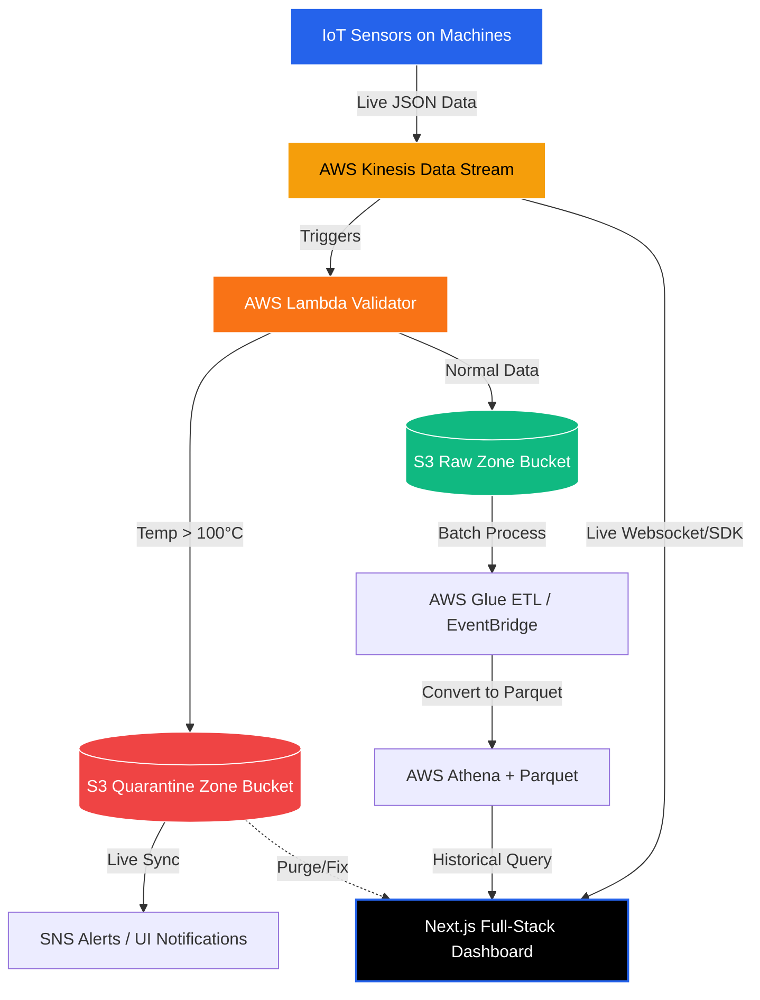

# 🚀 DataHub AI - Enterprise Data Engineering Project

Bhai, yeh file isliye banayi hai taaki aap isko padh kar poora project samajh sako aur sir ya kisi interviewer ke saamne full confidence se explain kar sako. Yeh document project ka **A to Z** cover karta hai.

---

## 1. Project Kya Hai? (What is this project?)
Yeh ek **Enterprise-Level Smart Manufacturing Data Platform** hai. Aaj kal badi-badi factories (jaise car manufacturing ya electronics) mein hazaron sensors lage hote hain jo lagatar temperature, vibration, aur RPM ka data bhejte hain. 
Hamara project ek aisa **AWS Data Pipeline + Full-Stack Dashboard** hai jo is saare sensor data ko real-time mein process karta hai, faulty machines ko pakadta hai, aur data ko saste (cost-optimized) tareeqe se store karta hai taaki baad mein uspe Machine Learning (Predictive Maintenance) lagayi ja sake.

---

## 2. Problem Statement (Hum kya problem solve kar rahe hain?)
Badi factories mein main problems yeh aati hain:
1. **Huge Volume of Data:** Har second hazaron data points aate hain. Normal database (MySQL) isko handle nahi kar sakta.
2. **Real-time Fault Detection:** Agar kisi machine ka temperature 100°C cross kar gaya, toh machine fatt sakti hai. Hamein instantly alert chahiye, kal subah report nahi!
3. **Storage Cost:** Pura data mahinon tak save karne ka AWS bill bohot zyada aata hai.
4. **Data Corruption:** Agar kharab ya aada-adhura data (sparse data) database mein chala gaya, toh Data Science model galat predict karega.

---

## 3. Our Solution (Hamara approach kya hai?)
Humne AWS ki top-tier services use karke ek **"Event-Driven Architecture"** banayi hai:
- **Scalability ke liye:** AWS Kinesis Data Streams use kiya hai jo per second lakho records handle kar sakta hai.
- **Real-Time Alert ke liye:** AWS Lambda lagaya hai jo hawa mein hi data ko check karta hai. Agar Temp > 100°C hai, toh use quarantine kar deta hai.
- **Cost Optimization ke liye:** S3 Layered Data Lake (Raw, Processed, Curated) banaya hai. Saath mein **S3 Lifecycle Policies** lagayi hain jo purane data ko saste Glacier storage mein daal deti hain.
- **UI & Monitoring:** Ek bohot hi premium **Next.js (React)** ka dashboard banaya hai jo directly AWS API se baat karke live graph dikhata hai.

---

## 4. Architecture Diagram (Data flow kaise hota hai?)
Niche diya gaya diagram batata hai ki data kaise travel karta hai:

**Step-by-Step Flow:**
1. Factory ke **IoT Sensors** data bhejte hain seedha **AWS Kinesis** mein.
2. **Lambda function** us data ko pakadta hai aur validate karta hai.
3. Agar data faulty hai (Anomaly), toh use **S3 Quarantine Zone** mein phek deta hai.
4. Agar data theek hai, toh use **S3 Raw Zone** mein save karta hai.
5. **Next.js Dashboard** Kinesis se live graph uthata hai, aur Quarantine zone se live red alerts uthata hai.
6. Purana data (Historical) **Athena** ke zariye Dashboard par sundar charts mein dikhaya jata hai.

---

## 5. Technology Stack (Konse Frameworks Use Hue Hain?)

**Frontend / UI:**
- **Next.js 14 (App Router):** Server-side aur client-side rendering ke liye. Yeh framework sabse best aur fast hai.
- **Tailwind CSS:** Premium styling, dark mode, aur green/blue matrix aesthetic ke liye.
- **Framer Motion:** Smooth animations aur popup modals ke liye.
- **Recharts:** Historical Analytics mein complex aur beautiful graphs banane ke liye.
- **Lucide React:** Modern icons ke liye.

**Backend / Data Engineering (AWS):**
- **Boto3 (Python):** AWS services ko programmatically handle aur simulate karne ke liye.
- **AWS Kinesis:** Streaming data ingestion.
- **AWS Lambda:** Serverless compute for real-time validation.
- **AWS S3:** Scalable Data Lake storage.
- **AWS Glue & Athena:** Serverless ETL aur SQL querying on Parquet data.
- **AWS IAM:** Security aur roles manage karne ke liye.

---

## 6. Future Goals (Aage kya add kar sakte hain?)
Is project mein aage chal kar hum yeh integrate kar sakte hain:
1. **Actual Machine Learning Models:** AWS SageMaker ka use karke actual predictive maintenance model train karna (abhi hum UI pe simulation dikha rahe hain).
2. **Mobile App:** Ek React Native app banana jisme plant manager ko phone par push notification aaye jab factory mein anomaly ho.
3. **Advanced Access Control:** Cognito add karna taaki alag-alag engineers apne account se login kar sakein.

---

### Conclusion (Sir ke saamne kya bolna hai?)
"Sir, maine sirf ek UI nahi banaya hai. Maine ek **Production-ready Data Engineering Pipeline** banayi hai. Jisme maine Data Quality (Quarantine Zone), Cost Optimization (S3 Lifecycle), aur Real-time Monitoring (Kinesis) teeno problems ko ek single dashboard se solve kiya hai."

All the best bhai! Padh lo isko achhe se, presentation phaad doge tum! 🚀
