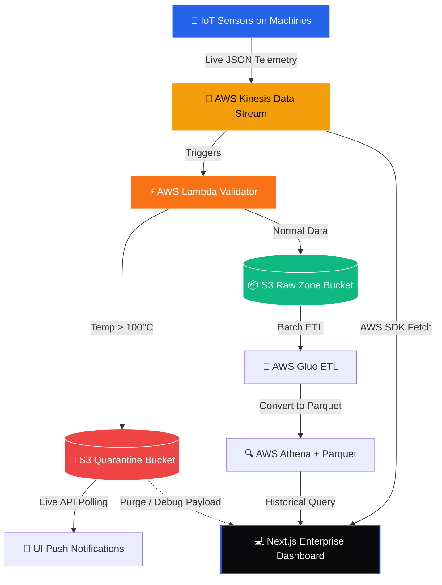

<div align="center">
  <h1>🚀 DataHub AI - Enterprise Smart Manufacturing Platform</h1>
  <p><strong>A Real-Time AWS Data Engineering Pipeline & Next.js Analytics Dashboard</strong></p>
  <p><i>Created by: <b>Vikash Kumar</b></i></p>
  
  <p>
    
    
    
  </p>
</div>

<br/>

## 📖 Overview

**DataHub AI** is an enterprise-grade Data Engineering project designed for the Smart Manufacturing sector. In modern factories, thousands of IoT sensors continuously transmit telemetry data (Temperature, Vibration, RPM) every second. Handling this massive throughput requires a robust, event-driven data pipeline.

This project implements a complete **Real-Time Data Pipeline** using AWS services, coupled with a stunning, high-performance **Next.js Dashboard** to monitor the data, detect anomalies, and perform historical analytics.

---

## 🛑 The Problem

1. **Volume & Velocity:** Traditional relational databases (like MySQL) crash when attempting to ingest millions of telemetry records per second.
2. **Real-Time Fault Tolerance:** If a machine's temperature exceeds critical limits (e.g., 100°C), relying on overnight batch processing is dangerous. Instant alerts and quarantine mechanisms are required.
3. **Storage Costs:** Storing petabytes of raw sensor data is extremely expensive.
4. **Data Corruption (Sparse Data):** Missing values in sensor logs can break downstream Machine Learning models.

---

## 💡 The Solution

DataHub AI solves these issues through a layered, highly-scalable architecture:

- **Ingestion:** **AWS Kinesis Data Streams** captures thousands of events per second with high durability.
- **Validation:** Serverless **AWS Lambda** functions instantly validate records in-flight. Normal data flows to the Raw Zone, while anomalous data (Temp > 100°C) is intercepted and routed to a Quarantine S3 Bucket.
- **Storage Optimization:** A multi-layered **AWS S3 Data Lake** (Raw, Processed, Curated) ensures organized storage. **S3 Lifecycle Rules** automatically transition older data to Glacier, cutting costs by up to 95%.
- **Analytics:** **AWS Athena** queries optimized Parquet datasets for historical analysis without needing a traditional data warehouse.
- **Visualization:** A beautiful **Next.js** frontend provides real-time monitoring and push notifications.

---

## 🏗️ Architecture Diagram



---

## 🚀 Key Features

### 1. Real-Time Telemetry Dashboard
- Displays live, continuously updating charts representing machine health.
- Monitors Kinesis data throughput (Total Processed Events).
- Integrated predictive maintenance visualization (SageMaker mockup).

### 2. S3 Quarantine Zone (Data Quality Enforcement)
- Defective records are automatically isolated.
- The UI features a **Live Polling Notification Bell** that immediately alerts operators when a new anomaly is detected in the S3 bucket.
- Detailed modal views allow operators to inspect the raw JSON payload of the anomaly directly from S3.

### 3. Historical Analytics
- Queries massive datasets (simulating Athena Parquet queries) with 7, 15, and 30-day filters.
- Features highly interactive Recharts (Area, Composed, Scatter, and Pie charts).
- Includes a real **Export to CSV** functionality for downstream reporting.

### 4. Enterprise Governance & Cost Control
- **AWS Billing Safety:** UI components require hard confirmations (typing "CONFIRM") before changing Kinesis Shard configurations to prevent accidental billing spikes.
- **Lifecycle Management:** Dynamically displays projected cost savings when configuring S3 Intelligent Tiering policies.

---

## 🛠️ Technology Stack

**Frontend:**
- **Next.js 14** (React, App Router)
- **Tailwind CSS** (Custom dark-mode enterprise matrix aesthetic)
- **Framer Motion** (Micro-animations and modals)
- **Recharts** (Data Visualization)
- **Lucide React** (Iconography)

**Cloud & Data Engineering (AWS):**
- **AWS Kinesis Data Streams**
- **AWS S3** (Simple Storage Service)
- **AWS Lambda**
- **Boto3** (Python SDK for simulating IoT data)

---

## ⚙️ How to Run Locally

### Prerequisites
- Node.js 18+
- Python 3.8+
- AWS Account configured locally (`aws configure`)

### 1. Setup AWS Infrastructure
Run the Python script to create the Kinesis stream and S3 buckets:
```bash
python setup_aws.py
```

### 2. Start the IoT Simulator
Generate live telemetry data and push it to AWS:
```bash
python iot_simulator.py
```

### 3. Start the Next.js Dashboard
```bash
cd frontend
npm install
npm run dev
```
Visit `http://localhost:3000` to view the live dashboard!

---

## 🔮 Future Goals
- **Machine Learning Integration:** Connect real AWS SageMaker endpoints to predict failures 24 hours in advance.
- **Mobile Alerting:** Implement AWS SNS (Simple Notification Service) to send SMS alerts to factory floor managers.
- **Role-Based Access Control:** Integrate Amazon Cognito for secure, multi-tenant login (Admin vs Operator views).

---
*Created with ❤️ by Vikash Kumar.*
